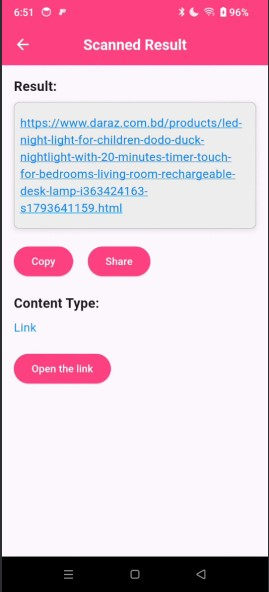

# qr_scanner_app

QR Scanner App
A modern and efficient Flutter-based QR code scanning application. This app is designed for quick and seamless scanning of QR codes, offering a clean and intuitive user experience.

Features
- Fast QR Code Scanning: Instantly scan and process QR codes.
- User-Friendly Interface: Designed with simplicity and functionality in mind.
- Cross-Platform Support: Works on both iOS and Android devices.
- Customization Ready: Easily customizable to meet your specific needs.

For help getting started with Flutter development, view the
[online documentation](https://docs.flutter.dev/), which offers tutorials,
samples, guidance on mobile development, and a full API reference.
